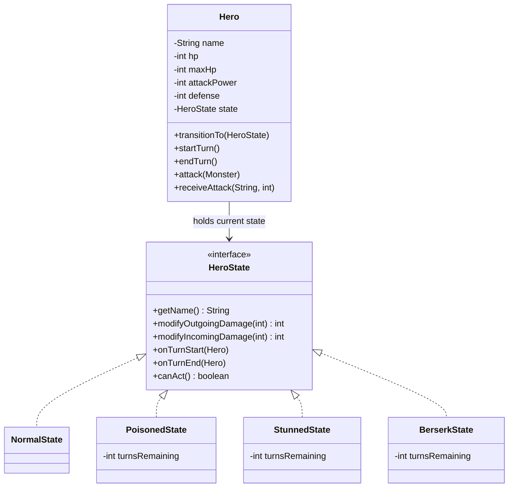

# UML Diagram 1 - State Pattern

```mermaid
classDiagram
    class Hero {
        -String name
        -int hp
        -int maxHp
        -int attackPower
        -int defense
        -HeroState state
        +transitionTo(HeroState)
        +startTurn()
        +endTurn()
        +attack(Monster)
        +receiveAttack(String, int)
    }

    class HeroState {
        <<interface>>
        +getName() String
        +modifyOutgoingDamage(int) int
        +modifyIncomingDamage(int) int
        +onTurnStart(Hero)
        +onTurnEnd(Hero)
        +canAct() boolean
    }

    class NormalState
    class PoisonedState {
        -int turnsRemaining
    }
    class StunnedState {
        -int turnsRemaining
    }
    class BerserkState {
        -int turnsRemaining
    }

    Hero --> HeroState : holds current state
    HeroState <|.. NormalState
    HeroState <|.. PoisonedState
    HeroState <|.. StunnedState
    HeroState <|.. BerserkState
```
