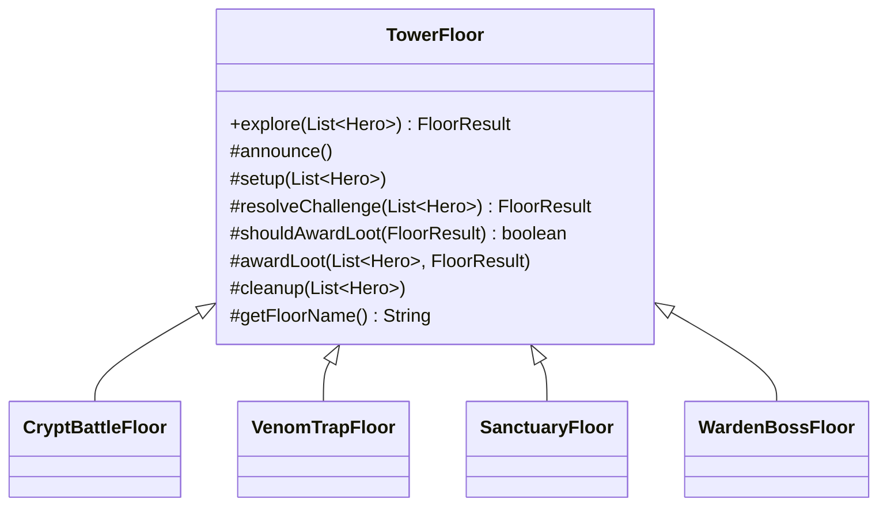

# UML Diagram 2 - Template Method Pattern

```mermaid
classDiagram
    class TowerFloor {
        +explore(List~Hero~) FloorResult
        #announce()
        #setup(List~Hero~)
        #resolveChallenge(List~Hero~) FloorResult
        #shouldAwardLoot(FloorResult) boolean
        #awardLoot(List~Hero~, FloorResult)
        #cleanup(List~Hero~)
        #getFloorName() String
    }

    class CryptBattleFloor
    class VenomTrapFloor
    class SanctuaryFloor
    class WardenBossFloor

    TowerFloor <|-- CryptBattleFloor
    TowerFloor <|-- VenomTrapFloor
    TowerFloor <|-- SanctuaryFloor
    TowerFloor <|-- WardenBossFloor
```
